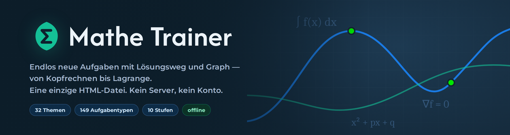
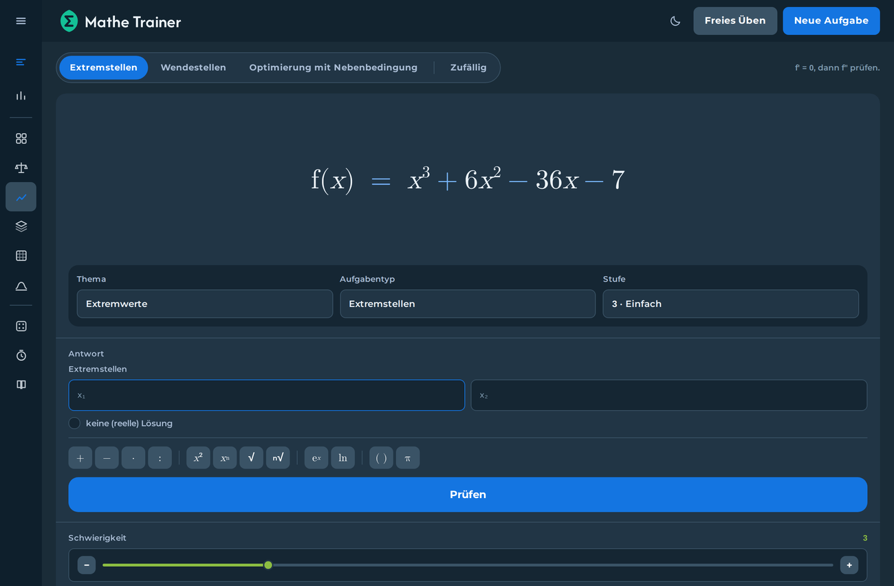
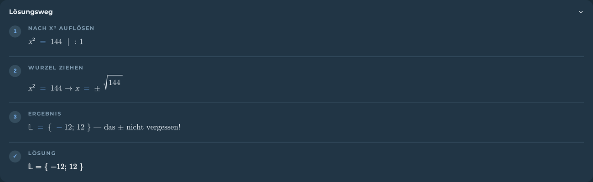
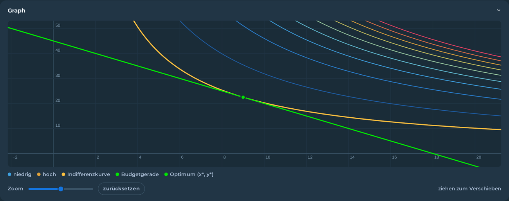

<p align="center">
  
</p>

Ein Übungsgenerator für Mathematik — von Kopfrechnen bis Lagrange-Optimierung. Jede Aufgabe wird beim Aufrufen neu erzeugt, exakt geprüft und auf Wunsch Schritt für Schritt vorgerechnet.

Das gesamte Programm ist **eine einzige HTML-Datei** ohne Server, Build-Schritt oder Netzwerkanfragen. Öffnen genügt — auch offline.

**[→ Live ausprobieren](https://DEIN-NAME.github.io/mathe-trainer/)**

---

## Screenshots

| Aufgabe mit Graph | Stochastik im Hellmodus |
|:--:|:--:|
|  |  |





## Funktionen

- **32 Themen, 149 Aufgabentypen, 10 Schwierigkeitsstufen.** Die Stufe steuert nicht nur die Zahlen, sondern auch die Struktur der Aufgabe.
- **Geprüfte Lösungen.** Vor der Anzeige testet der Generator jede Aufgabe zweifach: dass jede Zahl in der Lösung rational ist (Kettenbruch-Test) und dass die hinterlegte Lösung die eigene Prüffunktion besteht. Fällt eine Aufgabe durch, wird sie verworfen.
- **Exakte Auswertung.** Gerechnet wird mit Brüchen statt Fließkomma; `0,5`, `1/2` und `2/4` gelten gleichermaßen. Terme werden an Stützstellen verglichen, deshalb zählt auch `2(x+1)` als Antwort auf `2x+2`.
- **Lösungsweg auf Klick** — vorher verrät nichts die Lösung. Falsche Antworten führen zu weiteren Versuchen, nicht sofort zur Auflösung.
- **Graphen zu 106 Aufgabentypen**, inklusive Höhenlinien mit Gradient und Nebenbedingung. Zoomen und Verschieben direkt im Bild.
- **Fortschritt bleibt erhalten**: Trefferquote je Thema, Verlaufskurve und Serien werden lokal im Browser gespeichert.
- **Hell- und Dunkelmodus**, standardmäßig nach Systemeinstellung.

## Themen

| Bereich | Themen |
|---|---|
| Grundlagen | Kopfrechnen · Terme vereinfachen · Summen & Produkte · Definitionsmenge · Ökonomische Funktionen |
| Gleichungen | Lineare · Quadratische · Kubische · Bruch- · Betrags- · Potenz- · Wurzel- · Exponential- · Logarithmusgleichungen · Ungleichungen |
| Analysis | Grenzwerte · Folgen & Reihen · Ableitungen · Implizites Ableiten · Extremwerte · Integrale · Elastizitäten |
| Mehrdim. Analysis | Partielle Ableitungen · Gradient & Hesse · Extrema mit zwei Variablen · Lagrange-Optimierung |
| Lineare Algebra | Matrizen · Determinante & Inverse · Gauß-Verfahren · Vektorrechnung |
| Stochastik | Wahrscheinlichkeit · Kombinatorik |

## Eingabe

Kein LaTeX — die Schreibweise entspricht dem, was man ohnehin in eine Zeile tippt.

| Eingabe | Bedeutung |
|---|---|
| `2x` oder `2*x` | Multiplikation |
| `x^2`, `x^(n+1)` | Potenz |
| `1/x`, `(x+1)/(x-1)` | Bruch |
| `sqrt(x)`, `root(3, x)` | Quadrat- und n-te Wurzel |
| `e^(2x)`, `ln(x)` | e-Funktion und Logarithmus |
| `abs(x-3)` oder `\|x-3\|` | Betrag |
| `pi`, `e`, `inf` | π, e, ∞ |

Dezimalzahlen mit Punkt oder Komma. `f(2,5)` als Zahl und `root(3, x)` als Argumenttrenner werden auseinandergehalten.

Tastenkürzel: `Enter` prüfen bzw. weiter · `N` neue Aufgabe · `L` Lösungsweg

## Veröffentlichen

```
Repository/
├── index.html          ← die Trainer-Datei
├── README.md
└── assets/             ← Bilder für dieses README
```

`Settings → Pages → Source: Deploy from a branch`, Branch `main`, Ordner `/ (root)`. Nach wenigen Minuten ist die Seite unter `https://DEIN-NAME.github.io/repository/` erreichbar.

Die Datei ist vollständig eigenständig — Schriften, Icons und Logo stecken als Data-URI darin, es gibt keine externen Anfragen. Sie funktioniert deshalb auch von einem USB-Stick, in einem Lernmanagementsystem oder offline.

## Entwicklung

Die ausgelieferte Datei wird aus einzelnen Quelldateien zusammengebaut:

```bash
npm install          # nur die Schriften (Montserrat, Afacad)
python3 build.py     # erzeugt mathe-trainer.html
```

Tests:

```bash
node test.js     # 54.300 erzeugte Aufgaben auf Konsistenz
node guard.js    # Lösungen rational und mit der eigenen Prüfung verträglich
node verify.js   # angezeigte Lösungswege zurückrechnen und vergleichen
node dup.js      # Vorrat je Aufgabentyp und Stufe messen
node smoke.js    # Bedienung im Browser (Playwright)
```

## Technik

Reines HTML, CSS und JavaScript ohne Framework. Exakte Bruchrechnung über eine eigene Klasse, ein eigener Parser (Tokenizer und rekursiver Abstieg) für die Eingaben, Termvergleich über Stützstellen statt symbolischer Umformung, Höhenlinien über Marching Squares auf `<canvas>`.

## Lizenz

MIT
